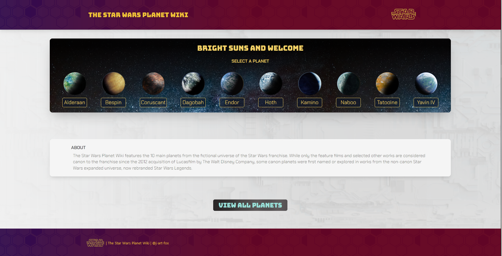
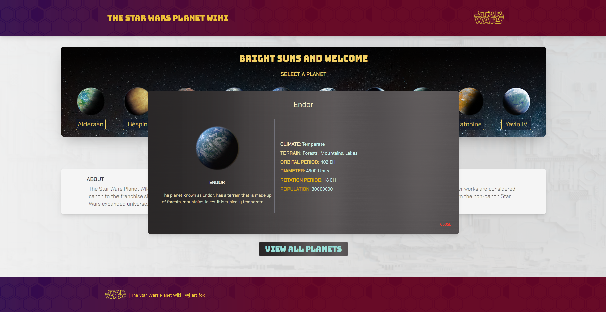
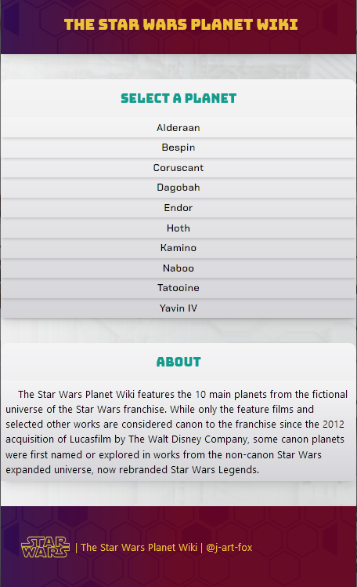

# The Star Wars Planet Wiki

## Introduction

The Star Wars Planet Wiki is a fun and interactive way to learn about the most popular planets from the Star Wars Universe.

## Usage
- Click on the image/button of the planet you'd like to learn more about.
- Read the details of the planet on the modal that displays on the screen.
- View all planet details at once with the view all planets option

## Preview

 

 

## Technologies
- Front-End: TypeScript, HTML5, SCSS, TailwindCSS, NodeJS, Angular

## Link
Deployed Application: https://beans-and-brew.herokuapp.com/
